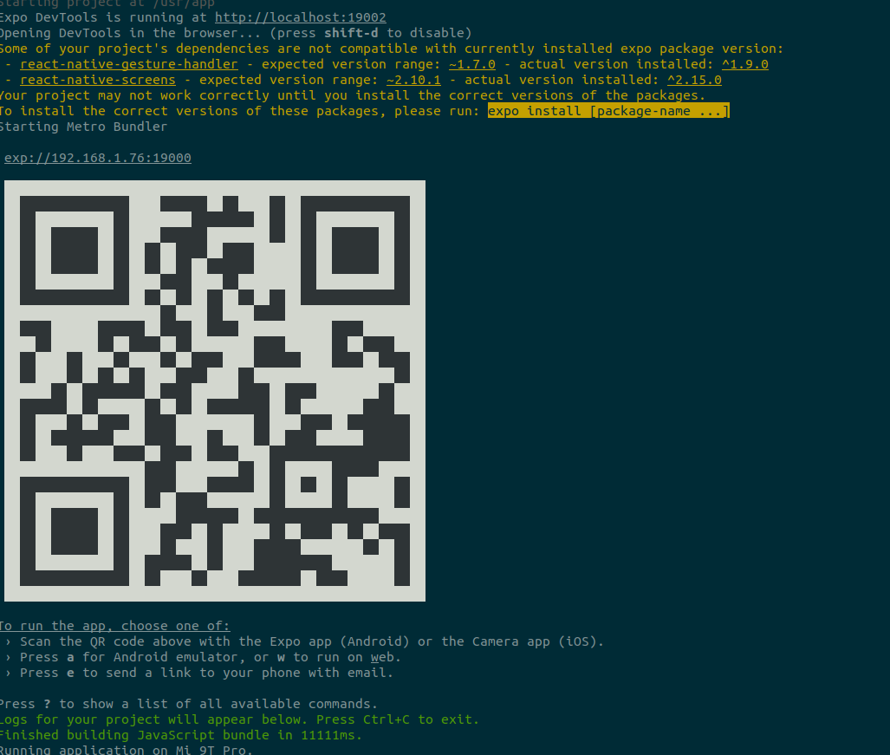

# DNE-Mobile

## Description

DNE-Mobile contient toutes les sources de la partie mobile de l'application DNE, effectuée dans le cadre du cours AcLab au sein de la promotion Master Informatique, Ingénierrie et Innovation 2022 à l'Université Catholique de Lille.
Celle-ci permet aux étudiants de visualiser leurs notes, leurs absences, leur planning, intéragir avec leur tuteur, etc..
Pour les tuteurs, elle permettra de visualiser les cours que l'étudiant suit, d'intéragir avec lui ou ses responsables.
Pour les responsables, elle permettra la saisie des notes, l'interaction avec l'étudiant / le tuteur, etc..

## Maquettage

Pour le développement de cette application nous avons réalisé des maquettes en amont via le logiciel Adobe XD, idéal pour réaliser des maquettes pour des applications mobiles. Des modifications ont été aportées à la version finale, cependant, ces maquettes ont été notre ligne de conduite pour le développement de l'application.

Maquette complète disponible ci-après : https://xd.adobe.com/view/54702321-ff21-4b5b-bbce-e3e56ab45cb7-0123/?fullscreen

## Installation d'Expo

Pour pouvoir tester notre application, il faudra installer l'**application expo** sur votre smartphone (Android ou iOS).

Expo est un cadre permettant de développer rapidement des applications natives React. Elle permet également, et c'est ce qui nous intéresse ici, de tester une application React en temps réel sans avoir à la déployer.

Celle-ci est disponible directement sur le **Play Store** ou l'**Apple Store**.

**/!\ ATTENTION :** Il faudra que votre ordinateur et votre smartphone soient connectés sur le même réseau Wifi pour pouvoir voir les modifications de votre application en temps réel sur votre smartphone.

## Lancement de l'application

L'application est très facilement testable via le container docker que nous avons créé et récupérable via cette commande :

```
docker pull giannigiux/dne-mobile:latest
```

Avant de lancer votre image docker, il faudra récupérer l'**IP privée** de votre ordinateur. (par exemple 192.168.0.31)

Pour la trouvée, voici un tutoriel : https://fr.wikihow.com/v%C3%A9rifier-son-adresse-IP-sur-Linux

Le tutoriel est prévu pour linux mais vous pourrez retrouver les mêmes informations via la commande `ipconfig` sous windows. (contre `ifconifg` sous linux)

Vous pourrez ensuite simplement lancer l'application avec la commande suivante :

```
docker run --env REACT_NATIVE_PACKAGER_HOSTNAME=192.168.0.31 -it -p 19000:19000 -p 19001:19001 -p 19002:19002 giannigiux/dne-mobile:latest
```

**En remplaçant 192.168.0.31 par votre adresse IP privée.**

<p align="center">
  
</p>

Le terminal vous affichera alors un **QR code** que vous pourrez scanner via **l'application Expo**. (sélectionnez **Scan QR Code** et **scanner le QR code**)

L'application devrait se lancer sur votre smartphone.

## Utilisation de l'application

Voici quelques exemples d'identifiants pour vous connecter sur l'application :

|Username|Password|Entité|
|:-:|:-:|:-:|
|nicolas.gouvy@univ-catholille.fr|L@Cath0l1ll€|Responsable Formation|
|julien.dudek@lacatholille.fr|L@Cath0l1ll€|Etudiant|
|morgan.lombard@lacatholille.fr|L@Cath0l1ll€|Etudiant|
|pierre.darcas@lacatholille.fr|L@Cath0l1ll€|Etudiant|
|pierre.2.lefebvre@saboite.com|L@Cath0l1ll€|Tuteur|
|stephanie.BEDIEZ@univ-catholille.fr|L@Cath0l1ll€|Administratif|
